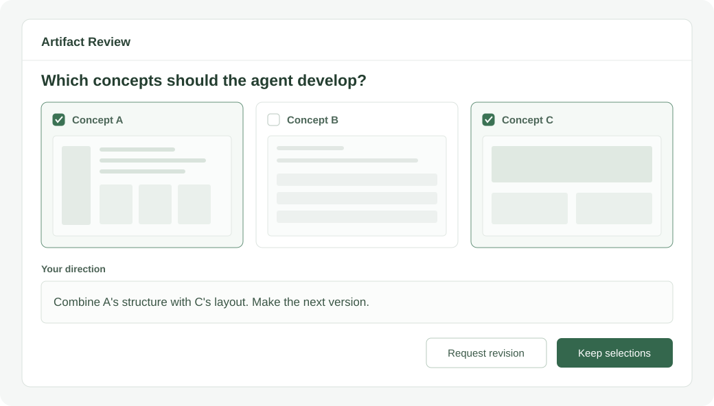
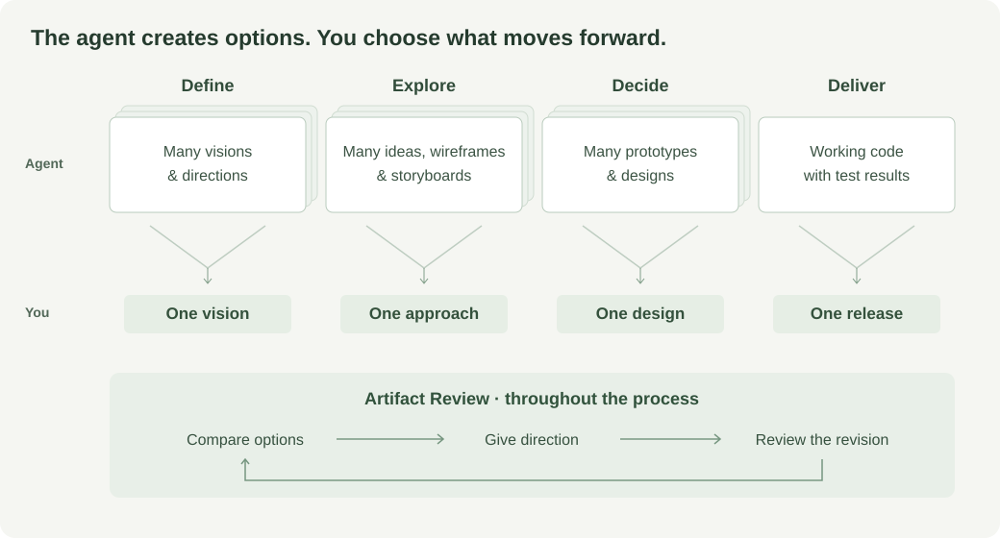

# Product Factory

**Hand over the generating. Keep the thinking.**



An agent can build a polished answer to the wrong question. Start with what you know: customer conversations, existing evidence, constraints, and questions worth investigating. The agent gathers more evidence, exposes gaps, and makes alternatives you can inspect.

Use that work to challenge assumptions, weigh tradeoffs, and decide what to leave out. Artifact Review carries your corrections into the next version before the agent builds further on a mistaken premise.

## How it works



Research starts with your evidence and questions, then adds sources and identifies gaps. Test a standalone prototype against real tasks: what can someone complete, where do they get stuck, and what needs to change? Carry those decisions into the build.

## The main skills

| Skill | What it does |
| --- | --- |
| [`software-factory`](skills/software-factory/SKILL.md) | Coordinates vision, research, design, implementation, and verification. |
| [`artifact-review`](skills/artifact-review/SKILL.md) | Presents the work for your judgment and carries your feedback into the next revision. |
| [`make-it-work`](skills/make-it-work/SKILL.md) | Implements an agreed outcome, runs independent reviews, fixes issues, and checks the real workflow. |

Skills guide how the agent works. Plugins can bundle skills, tools, and service connections. This repository supplies **26 skills**; model access, browsers, and deployment accounts come from your environment.

[Browse all skills](BUNDLE.md) · [Detailed product workflow](skills/software-factory/references/product-workflow.md)

## Setup

Paste this into Codex:

```text
Install the skills from https://github.com/exiao/product-factory
using its installer. Check the prerequisites first and preserve
any existing or customized skills. Tell me if there are conflicts.
```

Start a new Codex task in your project:

```text
Use $software-factory to develop [your product idea].
Stop at a playable prototype.
```

Installs into `~/.codex/skills` or `$CODEX_HOME/skills`. Existing skills are never overwritten. See [setup, updates, and runtime requirements](docs/setup.md).
