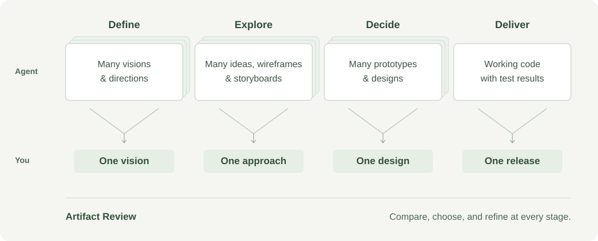
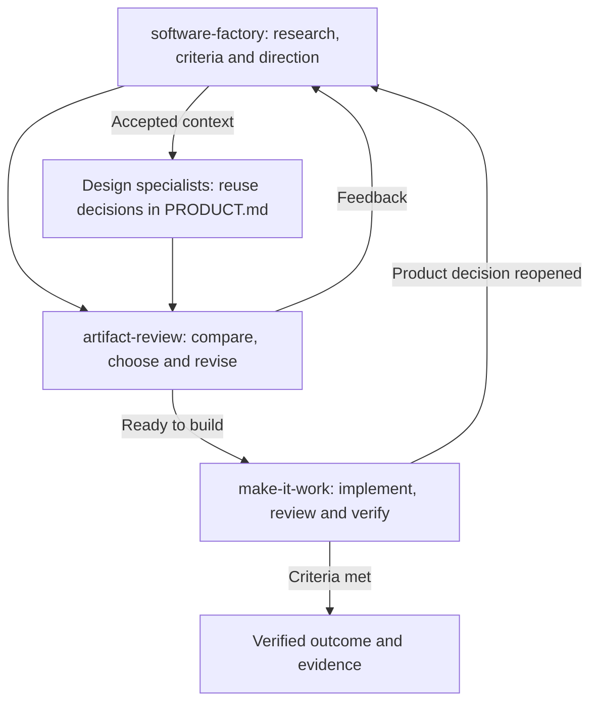

# Product Factory

**Hand over the generating. Keep the thinking.**


An agent can build a polished answer to the wrong question. Start with your customer conversations, research, and constraints. Product Factory helps the agent investigate the problem and turn possible solutions into concepts and prototypes you can inspect.

## How it works



Use Artifact Review to decide what to keep, combine, revise or leave out. Once you agree on the design, Make It Work implements it and checks the real workflow against your criteria. If new evidence changes the problem, return to that decision.

## The main skills

| Skill | What it does |
| --- | --- |
| [`software-factory`](skills/software-factory/SKILL.md) | Guides research and design, then hands implementation to Make It Work. |
| [`artifact-review`](skills/artifact-review/SKILL.md) | Lets you compare work, leave feedback and request revisions. |
| [`make-it-work`](skills/make-it-work/SKILL.md) | Implements an agreed outcome, fixes issues and verifies the real workflow. |

This repository supplies **29 skills** that guide how the agent works. Model access, browser tools, and deployment accounts come from your environment.

[Browse all skills](skills/) · [Detailed product workflow](skills/software-factory/references/product-workflow.md)

<details>
<summary>Workflow ownership</summary>



Focused requests use the relevant specialist. Reuse settled decisions and existing evidence; return to discovery only when the problem or direction changes.

</details>

## Setup

Paste this into Codex:

```text
Install the skills from https://github.com/exiao/product-factory
```

Start a new Codex task in your project, then try:

**Develop an idea**

```text
Use $software-factory to develop [your product idea].
Show me different directions before building a prototype.
```

**Map the unknowns**

```text
Use $explore-unknowns to map what we know, what we need to learn,
and which assumptions need checking before we build.
```

**Review the options**

```text
Use $artifact-review to compare these concepts with me.
Let me combine ideas and ask for changes.
```

**Build the chosen direction**

```text
Use $make-it-work to implement the agreed design
and verify the core workflow.
```

Have your agent copy the skill folders into `$CODEX_HOME/skills` (default `~/.codex/skills`). Before updating, compare the installed copies and back up any customizations outside that directory. Pulling this repository does not update installed copies. Updates are agent-assisted or manual; the custom installer and its receipts are no longer used.

Research needs web access; browser QA, image generation and deployment need your own tools and accounts. Native iOS testing needs macOS and Xcode. Missing optional tools limit the work that depends on them. Installing skills does not authorize publishing, spending or contacting people.

## Maintenance

GitHub Actions checks skill names/descriptions and local Markdown links directly in [the validation workflow](.github/workflows/validate.yml). These checks do not measure how well an agent performs product work.

The bundled Impeccable launcher may download a pinned engine on first use and needs network access for that download.

## Credits

Product Factory includes and adapts work from these projects and authors:

| Source | Used here |
| --- | --- |
| [Impeccable](https://github.com/pbakaus/impeccable) by [Paul Bakaus](https://github.com/pbakaus) | The bundled [Impeccable skill and tooling](skills/impeccable/SKILL.md), used by the design workflow. |
| Anshu Chimala's [How to turn your AI into a world-class designer](https://www.lennysnewsletter.com/p/how-to-turn-your-ai-into-a-world) | Design-mode's [creative exploration guidance](skills/design-mode/references/creative-exploration.md), adapted from the accessible portion of the article. |

Further method references are documented alongside the relevant skills. Original source links and license notices remain with the material; this repository does not relicense it or imply endorsement by its authors.

The Artifact Review skill includes a reusable responsive review template and a local, fixed-task Codex submission bridge. Its bundled visual identity is the default; explicit project direction can override it. Personal PDF libraries and machine-specific paths are not required.
