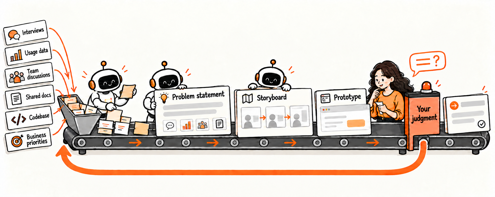
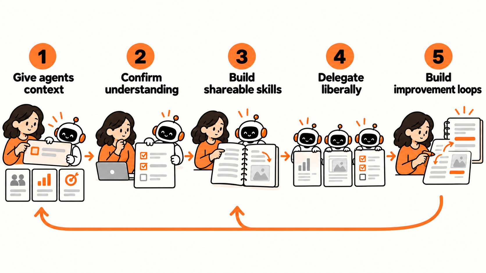

# Product Factory

**Teach your coding agents how you make product decisions.**

Skills for coding agents such as Codex and Claude Code, covering research, design, implementation, and learning from past work. Each skill is a readable `SKILL.md` instruction manual you can edit and share with your team.



## Get started

Ask your coding agent:

```text
Read https://github.com/exiao/product-factory and install its skills.
Preserve my existing customizations.
```

Then try:

```text
Use $product-factory to investigate [product problem].
Use our customer evidence and priorities. Ask about important gaps,
and show me possible directions before building a prototype.
```

## Set up and improve your factory



| Step | Workflow or tool | What you get |
| --- | --- | --- |
| Tell your agent about you | [`get-to-know-me`](skills/get-to-know-me/SKILL.md) | A profile of your role, current work, goals, and preferences for you to review. |
| Connect agents to your data | [`connect-your-data`](skills/connect-your-data/SKILL.md) | Checked source access, important context, and a reusable brief. |
| Build shareable skills | Your coding agent's skill creator, or [meta-skills](https://github.com/exiao/meta-skills/tree/main/skill-creator) | Instructions that capture a repeatable team practice. |
| Change how agents communicate | [`product-factory`](skills/product-factory/SKILL.md#clarify-before-dependent-work) and [`review-with-me`](skills/review-with-me/SKILL.md) | Clarifying questions and actual work you can inspect and respond to. |
| Delegate to coworkers | [`product-factory`](skills/product-factory/SKILL.md), [`make-it-work`](skills/make-it-work/SKILL.md), and native delegation tools | Bounded assignments and checked results. |
| Build improvement loops | [`inspect-traces`](skills/inspect-traces/SKILL.md), then an existing evaluator and hill-climbing workflow as needed | A diagnosed failure and a supported change. |

Invoke a skill with a request such as `$connect-your-data for this project`. Reuse existing context and decisions; run only the steps you need. See the [setup workflow](skills/product-factory/references/factory-setup.md) for handoffs.

Try `$get-to-know-me` when introducing yourself to an agent or updating your role and goals. It prepares a short addition to your project's `AGENTS.md` for your review, preserving existing instructions. You can choose another location. You do not need to repeat the interview for every task.

Optional [meta-skills](https://github.com/exiao/meta-skills) tools cover [skill creation](https://github.com/exiao/meta-skills/tree/main/skill-creator), [audits](https://github.com/exiao/meta-skills/tree/main/skill-audit), and [evaluated optimization](https://github.com/exiao/meta-skills/tree/main/skill-improver). Use your agent's built-in creator when available; these tools are not bundled here.

Give delegated work an outcome, context, boundaries, and completion check. Inspect traces to diagnose a failure; use an evaluator and hill-climbing when comparing repeated attempts. A one-off correction may need only a fix and recheck.

## Run a product task

| Order | Invoke | What it does | When needed |
| --- | --- | --- | --- |
| 1 | [`connect-your-data`](skills/connect-your-data/SKILL.md) | Check access and gather the evidence and priorities the task needs. | When project context is missing or scattered. |
| 2 | [`product-factory`](skills/product-factory/SKILL.md) | Clarify the task, investigate the problem, explore directions, design, prototype, and review with you. | Main entry point; it coordinates the specialists. |
| 3 | [`make-it-work`](skills/make-it-work/SKILL.md) | Implement the agreed outcome and verify the real workflow. | After design agreement; Product Factory can hand off within the authorized scope. |
| 4 | [`inspect-traces`](skills/inspect-traces/SKILL.md) | Find mistakes and repeated corrections to improve future work. | After a task or recurring failure. |

Usually, invoke `$product-factory` and ask it to carry the agreed work through delivery. It uses [design-mode](skills/design-mode/SKILL.md) for designs and prototypes and [review-with-me](skills/review-with-me/SKILL.md) for your judgment and revisions. Invoke those specialists directly for focused work; clarification does not require a separate skill call.

For focused work, try [explore-unknowns](skills/explore-unknowns/SKILL.md) to uncover assumptions, [design-review](skills/design-review/SKILL.md) to check usability and accessibility, or [synthetic-userstudies](skills/synthetic-userstudies/SKILL.md) for simulated walkthroughs. Simulated findings are hypotheses, not customer evidence.

[Browse all skills](skills/).

## For coding agents

Reading the accompanying article? Open [this repository](https://github.com/exiao/product-factory) for the actual instructions.

- Read project instructions and the relevant `SKILL.md`, loading references as needed. Use the [product workflow](skills/product-factory/references/product-workflow.md) for a full initiative.
- Reuse accepted decisions, ask about important gaps, and verify results. Keep evidence and assumptions distinct.
- Install only when requested. Copy complete skill folders into the target agent's supported directory; compare existing copies and preserve customizations. For Codex, use `$CODEX_HOME/skills`, defaulting to `~/.codex/skills`.
- Report missing tools or access. Skill installation does not authorize publishing, spending, deployment, or messages.

<details>
<summary>Runtime requirements and updates</summary>

Model access and tools come from your coding-agent environment. Research needs web access; browser QA, image generation, and deployment need the corresponding tools and accounts. Native iOS testing needs macOS and Xcode.

Review With Me includes a review template and an optional Codex feedback bridge. Saved feedback is not proof of dispatch or completed revisions.

Pulling this repository does not update installed copies. If you installed `impeccable`, preserve any customizations in `design-mode` and retire the old installed folder. When replacing `software-factory` with `product-factory`, preserve customizations and retire the old folder. Also retire any installed `confirm-understanding` copy after preserving customizations; its guidance now lives in `product-factory`. Replace retired `design-eval` and `ui-lint` copies with `design-review`.

Replace `gather-context` with `connect-your-data` and `artifact-review` with `review-with-me`, preserving customizations. Copy the complete `review-with-me` folder, including its scripts and template. Existing reviews keep their saved-feedback keys.

[CI](.github/workflows/validate.yml) checks metadata, links, and review persistence and dispatch. It does not measure downstream agent performance.

</details>

## Credits

- Anshu Chimala's [How to turn your AI into a world-class designer](https://www.lennysnewsletter.com/p/how-to-turn-your-ai-into-a-world): [creative exploration guidance](skills/design-mode/references/creative-exploration.md), adapted from the accessible portion of the article.

Original source links and license notices remain with the material; this repository does not relicense it or imply endorsement.
