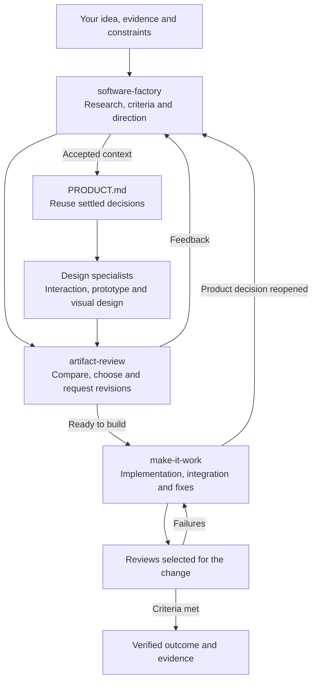
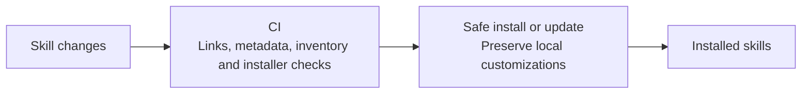

# Workflow ownership

[Software Factory](../skills/software-factory/SKILL.md) owns product direction, [Artifact Review](../skills/artifact-review/SKILL.md) carries human judgment, and [Make It Work](../skills/make-it-work/SKILL.md) owns delivery. These are handoffs within the existing task, not separate tasks or new approval gates.

The [existing discovery sequence](../skills/software-factory/references/product-workflow.md) still applies. Reuse sufficient artifacts and settled decisions; stop at the user's requested finish line. A contained fix goes directly to Make It Work. Focused reviews and design requests go to their specialist without launching the full sequence.

At the design handoff, [design-mode](../skills/design-mode/SKILL.md#product-context-handoff) translates accepted product facts into Impeccable's current PRODUCT.md format. Keep evidence and criteria linked to their sources. Impeccable owns visual workflow and tooling; design-mode supplies preferences and artifact requirements.

Make It Work owns the verification rules; this table summarizes coverage by surface:

| Change | Coverage |
|---|---|
| Contained code, CLI, backend or configuration | Code review, relevant repository checks and execution of the affected workflow |
| Interface or interaction | Add relevant usability, accessibility and visual checks |
| New user-facing product or substantial new journey | Add a representative end-to-end task and synthetic walkthrough, with simulation limits explicit |

Reviews reuse valid evidence and recheck affected paths. Goal tracking and recurring follow-ups require the user's request and runtime support; neither is a prerequisite for ordinary delivery.

## Maintaining the bundle

See [setup and updates](setup.md) for the commands and [Make It Work](../skills/make-it-work/SKILL.md) for the delivery rules.
